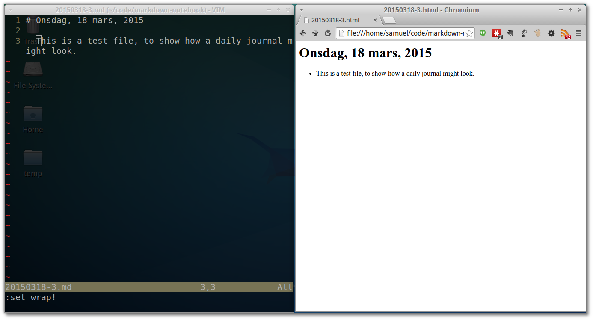

# Markdown Notebook
I couldn't find a suitable simple Markdown Notebook, so I "created my own" 

## Features

- Automatically creates a datestamped daily journal file, with the date in the heading
- Opens for editing in vim
- Commits and pushes the changes after closing vim
- A script to convert all files from markdown to html (if viewing on github/bitbucket is not enough)

## Dependencies

- Requires [pandoc](http://pandoc.org/) for the markdown-to-html conversion

## Usage

1. `git init .`
2. `git remote add blabla...` (E.g. bitbucket private repo)
3. `./edit.sh` (Will create a new datestamped file and open it in vim)
4. Write
5. Save
6. Exit (The journal will be committed and pushed to the origin at this point)
7. Create viewable file(s):
  - `./mdtohtml_perfile.sh` for one HTML file per journal file / day (in `html/` folder)
  - `./mdtoepub_perfile.sh` for one EPUB file per journal file / day (in `epub/` folder)
  - `./mdtohtml_merge.sh` for one single HTML page, with all journal files merged.
  - `./mdtoepub_merge.sh` for one single EPUB, with all journal files merged.
9. Open one of the generated files for viewieng history (could be `chromium-browser html/<filename>.html` (or `exo-open epub/<filename>.epub` to open in your OSs epub-reader, on ubuntu at least).)
